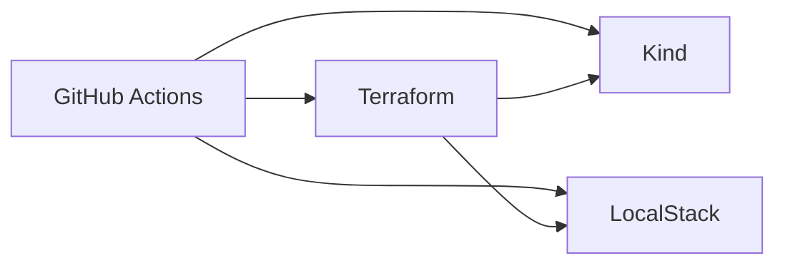

# Test Infra LocalStack (+ Kind EKS)

Sample infrastructure on **LocalStack (free)** with Terraform, split into **shared / network / backend / eks** projects and **dev / staging** environments.

**Kind** provides a real local Kubernetes control plane that **mirrors** LocalStack/AWS EKS Terraform (IAM roles, cluster/node-group naming, sample workloads). LocalStack community does **not** expose the EKS API (Pro-only), so `aws_eks_*` is not called — Kind + matching outputs stand in.

**CI architecture (default)**

```
Git Push
   │
   ▼
GitHub Actions
   │
   ├── Kind cluster (testinfra-eks)
   ├── LocalStack (Docker Compose)
   └── Terraform CLI (plan/apply) + local terraform.tfstate
           │
           ▼
      LocalStack (:4566)  +  Kind API / NodePort :30080
```



Optional: Terraform Cloud for remote state only (`BACKEND=cloud`, workspaces must be **execution_mode=local**). Org: **`ExperimentTerraform`**.

## Workspace map (optional TFC)

| TFC project | Workspace (dev) | Workspace (staging) |
|---|---|---|
| `testinfra-shared` | `testinfra-shared-dev` | `testinfra-shared-staging` |
| `testinfra-network` | `testinfra-network-dev` | `testinfra-network-staging` |
| `testinfra-backend` | `testinfra-backend-dev` | `testinfra-backend-staging` |
| `testinfra-eks` | `testinfra-eks-dev` | `testinfra-eks-staging` |

Apply order per environment: **shared → network → backend → eks**

## Quick start (recommended)

```bash
chmod +x scripts/*.sh
./scripts/up.sh                      # Kind + LocalStack
./scripts/use-local-backend.sh       # default: local tfstate (no TFC remote apply)
./scripts/env.sh staging apply       # includes verify-apply.sh
./scripts/verify-apply.sh staging    # re-run checks anytime
```

### Optional: Terraform Cloud remote state

```bash
export TF_TOKEN_app_terraform_io="..."
./scripts/use-tfc-backend.sh             # enforces execution_mode=local
./scripts/env.sh staging apply
```

If you see `Preparing the remote apply...`, the workspace is still **remote** — run `./scripts/ensure-tfc-local-execution.sh` or switch back with `./scripts/use-local-backend.sh`.

## GitHub Actions

1. Push to `main` → plan+apply **staging**; PRs → **plan** only (applies upstream stacks first so sibling `terraform_remote_state` works on a fresh runner)
2. Manual runs: **Actions → Terraform LocalStack → Run workflow**
3. Optional TFC: set secret `TF_TOKEN_app_terraform_io` and change workflow `BACKEND` to `cloud`

Workflow file: [`.github/workflows/terraform.yml`](.github/workflows/terraform.yml)

## Documentation

| Doc | Contents |
|---|---|
| [docs/STEP_BY_STEP.md](docs/STEP_BY_STEP.md) | Local & CI apply/destroy, optional TFC, troubleshooting |
| [docs/ARCHITECTURE.md](docs/ARCHITECTURE.md) | Flowcharts, Kind↔EKS mirror, component responsibilities |

## Layout

```
localstack-infra/
├── .github/workflows/terraform.yml
├── docker-compose.yml
├── kind/cluster.yaml
├── docs/
├── lambda/api/
├── scripts/          # up, kind-up/down, env, verify-apply, …
└── terraform/
    ├── modules/      # includes eks/
    ├── tfc-bootstrap/
    └── live/
        ├── _templates/
        ├── dev/{shared,network,backend,eks}/
        └── staging/{shared,network,backend,eks}/
```

## Notes

- LocalStack endpoint: `http://localhost:4566` (dummy creds `test` / `test`)
- Kind cluster: `testinfra-eks` (kubeconfig under `.kube/`, gitignored)
- Default state backend is **local** (avoids TFC remote apply, which cannot reach LocalStack/Kind)
- Not included on LocalStack free: Amplify, CloudFront, WAF, RDS, ElastiCache, OpenSearch, ECS, **EKS API** (Kind mirrors EKS instead)
- If using TFC: workspaces **must** use `execution_mode = "local"`
