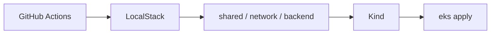

# Test Infra LocalStack (+ Kind EKS)

Sample infrastructure on **LocalStack (free)** with Terraform, split into **shared / network / backend / eks** projects and **dev / staging / production** environments.

**Kind** provides a real local Kubernetes control plane that **mirrors** LocalStack/AWS EKS Terraform (IAM roles, cluster/node-group naming, sample workloads). LocalStack community does **not** expose the EKS API (Pro-only), so `aws_eks_*` is not called — Kind + matching outputs stand in.

**CI architecture (default)** — Kind is deferred until the `eks` stack so early
stacks are not starved by Kind+LocalStack Docker contention on small runners:

```
Git Push
   │
   ▼
GitHub Actions
   │
   ├── tflint + checkov (static analysis)
   ├── LocalStack (Docker Compose) + latency smoke
   ├── Terraform: shared → network → backend
   ├── Kind cluster (testinfra-eks) + latency smoke
   └── Terraform: eks + verify-apply
           │
           ▼
      LocalStack (:4566)  +  Kind API / NodePort :30080
```



Optional remote state:

- `BACKEND=s3` — S3 + DynamoDB on LocalStack (`./scripts/use-s3-backend.sh`)
- `BACKEND=cloud` — Terraform Cloud (`execution_mode=local`). Org: **`ExperimentTerraform`**.

## Workspace map (optional TFC)

| TFC project | Workspace (dev) | Workspace (staging) | Workspace (production) |
|---|---|---|---|
| `testinfra-shared` | `testinfra-shared-dev` | `testinfra-shared-staging` | `testinfra-shared-production` |
| `testinfra-network` | `testinfra-network-dev` | `testinfra-network-staging` | `testinfra-network-production` |
| `testinfra-backend` | `testinfra-backend-dev` | `testinfra-backend-staging` | `testinfra-backend-production` |
| `testinfra-eks` | `testinfra-eks-dev` | `testinfra-eks-staging` | `testinfra-eks-production` |

Apply order per environment: **shared → network → backend → eks**

## Quick start (recommended)

```bash
chmod +x scripts/*.sh
./scripts/up.sh                      # Kind + LocalStack
./scripts/use-local-backend.sh       # default: local tfstate (no TFC remote apply)
./scripts/env.sh staging apply       # includes verify-apply.sh
./scripts/verify-apply.sh staging    # re-run checks anytime
```

### Optional: S3 + DynamoDB remote state (LocalStack)

```bash
./scripts/use-s3-backend.sh staging  # bootstrap bucket+lock table, sync BACKEND=s3
./scripts/env.sh staging apply
```

### Optional: Terraform Cloud remote state

```bash
export TF_TOKEN_app_terraform_io="..."
./scripts/use-tfc-backend.sh             # enforces execution_mode=local
./scripts/env.sh staging apply
```

If you see `Preparing the remote apply...`, the workspace is still **remote** — run `./scripts/ensure-tfc-local-execution.sh` or switch back with `./scripts/use-local-backend.sh`.

## GitHub Actions

1. Push to `main` → plan+apply **staging** with `BACKEND=s3`; PRs → **plan** only (applies upstream stacks first so sibling `terraform_remote_state` works on a fresh runner)
2. Manual runs: **Actions → Terraform LocalStack → Run workflow** — choose `environment`, `action`, and **`backend`** (`local` / `s3` / `cloud`)
3. Scheduled **Drift check** (daily) + manual: [`.github/workflows/drift-check.yml`](.github/workflows/drift-check.yml) — re-validates 0-drift after a fresh apply (see Architecture for ephemeral-LocalStack limits)
4. Optional TFC (`backend=cloud`): set secret `TF_TOKEN_app_terraform_io`

Workflow files: [`.github/workflows/terraform.yml`](.github/workflows/terraform.yml), [`.github/workflows/drift-check.yml`](.github/workflows/drift-check.yml)

## Documentation

| Doc | Contents |
|---|---|
| [docs/STEP_BY_STEP.md](docs/STEP_BY_STEP.md) | Local & CI apply/destroy, optional TFC, troubleshooting |
| [docs/ARCHITECTURE.md](docs/ARCHITECTURE.md) | Flowcharts, Kind↔EKS mirror, CI Kind-deferred sequencing |

## Layout

```
localstack-infra/
├── .github/workflows/{terraform,drift-check}.yml
├── docker-compose.yml
├── kind/cluster.yaml
├── docs/
├── lambda/api/
├── scripts/          # up, kind-up/down, env, verify-apply, check-drift, use-*-backend, sync-live
├── tests/verify/     # verify-apply modules (sourced by scripts/verify-apply.sh)
└── terraform/
    ├── modules/      # includes eks/
    ├── tfc-bootstrap/
    ├── s3-bootstrap/ # BACKEND=s3 bucket + DynamoDB lock table
    └── live/
        ├── _templates/
        ├── dev/{shared,network,backend,eks}/
        ├── staging/{shared,network,backend,eks}/
        └── production/{shared,network,backend,eks}/
```

## Notes

- Environments: **dev** / **staging** / **production** (CIDRs `10.3` / `10.1` / `10.2`; NodePorts 30081 / 30080 / 30082). Production defaults: 30d log retention, stricter SQS depth alarm, 30d secret recovery — see [docs/ARCHITECTURE.md](docs/ARCHITECTURE.md)
- LocalStack endpoint: `http://localhost:4566` (dummy creds `test` / `test`)
- Kind cluster: `testinfra-eks` (kubeconfig under `.kube/`, gitignored)
- Default state backend is **local**; opt-in `BACKEND=s3` (LocalStack) or `BACKEND=cloud` (TFC)
- Free-tier hardening: S3 SSE/versioning/lifecycle, SQS SSE+DLQ, EC2 IMDSv2+EBS encrypt, Secrets recovery window, S3 Gateway VPC endpoint, Lambda X-Ray/DLQ/concurrency, API GW access logs+throttle, CW alarms → SNS → **ops alerts SQS** (swap for email/Slack on real AWS), EKS sample HA, Kind↔LocalStack SQS/SNS bridge
- Drift: `./scripts/check-drift.sh <env>` (also used by `verify-apply.sh` and the scheduled drift-check workflow)
- Kind cluster: **2 workers** + metrics-server (`./scripts/kind-up.sh`). After changing `kind/cluster.yaml`, recreate with `./scripts/kind-down.sh && ./scripts/kind-up.sh`
- **Still not included** on LocalStack free (Pro/paid or real AWS only): Amplify, CloudFront, WAF, RDS, ElastiCache, OpenSearch, ECS, real **NAT Gateway** routing, real **EKS API** / IRSA OIDC validation, Secrets auto-rotation, customer-managed KMS rotation. Kind mirrors EKS instead of calling `aws_eks_*`.
- If using TFC: workspaces **must** use `execution_mode = "local"`
