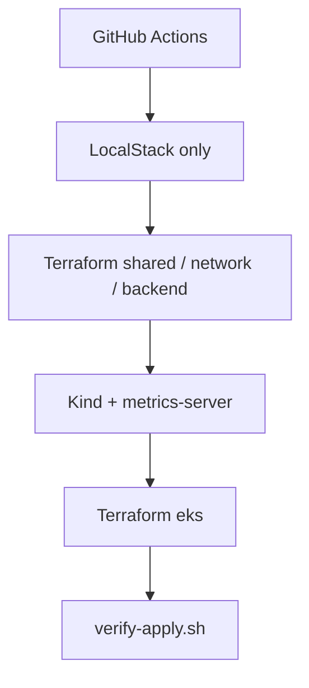
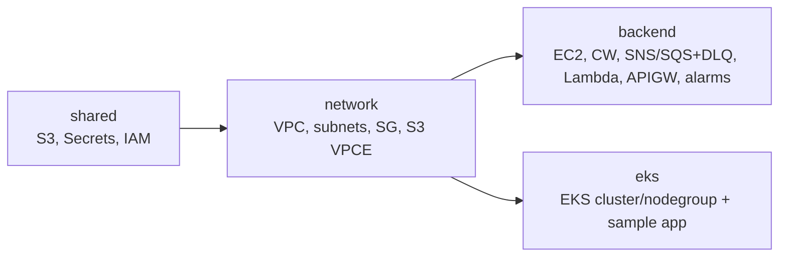
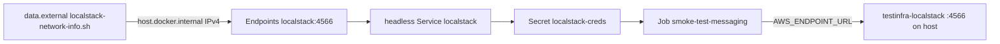

# Architecture

## Runtime flow (local / GitHub Actions)

### Local (one-command DX)

`./scripts/up.sh` still starts **Kind first**, then LocalStack, then bridges
networks — fine on a laptop with enough CPU/RAM.

### CI sequencing (Kind deferred) {#ci-sequencing-kind-deferred}

On small GitHub-hosted runners, Kind (3 nodes + metrics-server) and LocalStack
(`LAMBDA_RUNTIME_EXECUTOR=docker` → host `docker.sock`) contend for the same
Docker daemon and CPU. That starvation made even `aws_s3_bucket` hang for nearly
an hour during the first stack. CI therefore:

1. Start **LocalStack alone** (`SKIP_KIND=1 ./scripts/up.sh`) + latency smoke  
2. Terraform **shared → network → backend** (no Kind)  
3. Start **Kind** + bridge LocalStack onto the `kind` network + latency smoke  
4. Terraform **eks** + `verify-apply.sh`

Root-cause write-up: [FIX_CI_HANG_V2_S3_CONTENTION.md](./FIX_CI_HANG_V2_S3_CONTENTION.md).  
Containment (resource/step timeouts, diagnostics): [FIX_CI_TIMEOUT_HANG.md](./FIX_CI_TIMEOUT_HANG.md).



```
                    GitHub Actions (CI)
                                   │
                                   ▼
                         docker compose up  (LocalStack alone)
                                   │
                         latency smoke (s3 ls < 5s)
                                   │
              Terraform: shared → network → backend
                                   │
                         kind-up.sh (pods use host.docker.internal → :4566)
                                   │
                         latency smoke again
                                   │
                         Terraform: eks → verify
```

Local `./scripts/up.sh` flow (unchanged convenience):

```
        kind create cluster                 docker compose up
        (testinfra-eks)                     (LocalStack free)
                 │                                   │
                 └─────────────────┬─────────────────┘
                                   ▼
                         Terraform CLI (all stacks)
              shared → network → backend → eks
```

State backends:

- `BACKEND=local` (default) — `terraform.tfstate` on disk
- `BACKEND=s3` — S3 bucket `tfstate-<project>-<env>` + DynamoDB lock table
  `tflock-<project>-<env>` on LocalStack (bootstrap via `./scripts/use-s3-backend.sh`)
- `BACKEND=cloud` — Terraform Cloud remote state; workspaces must use
  `execution_mode=local` — TFC agents cannot reach LocalStack, Kind, or parent-dir modules

## Kind ↔ LocalStack EKS mirror

LocalStack **community** does not implement the EKS API (Pro-only). This repo mirrors the
usual LocalStack/AWS EKS Terraform shape on **Kind** instead:

| Real AWS / LocalStack Pro EKS | This repo (free) |
|---|---|
| `aws_eks_cluster` | Logical cluster name + synthetic ARN + Kind control plane |
| `aws_eks_node_group` | Logical node group + Kind worker node(s) |
| Cluster / node IAM roles | `aws_iam_role` on LocalStack (same trust policies) |
| Workloads | Terraform **kubernetes** provider → Kind |
| Sample exposure | NodePort `30080` (Kind `extraPortMappings`) |
| Cluster record | ConfigMap `eks-mirror-<name>` in Kind `default` ns |

## Responsibilities

| Component | Role |
|---|---|
| **GitHub Actions / scripts** | Orchestrates Kind + LocalStack + Terraform CLI; static analysis (tflint/checkov) |
| **Kind** | Real local Kubernetes (EKS stand-in) |
| **LocalStack** | Emulates AWS APIs (S3, IAM, EC2, Lambda, API GW, SNS/SQS, DynamoDB, X-Ray, …) |
| **Terraform CLI** | Plans/applies against LocalStack + Kind |
| **Terraform Cloud** | Optional remote state only (`BACKEND=cloud`, `execution_mode=local`) |
| **S3+DynamoDB (LocalStack)** | Optional remote state (`BACKEND=s3`) |

## Terraform projects (per environment)



| Project | Resources |
|---|---|
| **shared** | S3 (+ SSE-S3, versioning, lifecycle), Secrets Manager (recovery window), IAM role/instance profile (scoped CW logs) |
| **network** | VPC (DNS on), 3 public + 3 private subnets, IGW, public/private RTs, **S3 Gateway VPC endpoint**, SG (443 + 3000) |
| **backend** | EC2 (IMDSv2, encrypted EBS) in private subnet, CW log group (14d), SNS→SQS (+DLQ, SSE-SQS), Lambda (DLQ, reserved concurrency, X-Ray), API Gateway (access logs, throttle, usage plan), CW alarms → ops SNS |
| **eks** | EKS-shaped IAM + Kind mirror record + sample nginx (2 replicas, probes, resources; LocalStack free: no `aws_eks_*`) |

Cross-stack reads (backend/eks → network/shared):

- **TFC mode** (`tfc_organization = "ExperimentTerraform"`): `tfe_outputs`
- **Local mode** (`tfc_organization = ""`): `terraform_remote_state` on sibling `terraform.tfstate` files
- **S3 mode** (`BACKEND=s3`): `terraform_remote_state` against LocalStack S3 keys `shared|network/terraform.tfstate`

## Environments

| Env | VPC CIDR | Resource prefix | EKS cluster name |
|---|---|---|---|
| `dev` | `10.3.0.0/16` | `testinfra-dev` | `testinfra-eks-dev` |
| `staging` | `10.1.0.0/16` | `testinfra-stg` | `testinfra-eks-staging` |

## Production-readiness additions (still free-tier)

Hardening that stays within LocalStack Community coverage:

| Area | What we added |
|---|---|
| **State safety** | Opt-in `BACKEND=s3` (S3 + DynamoDB lock) via `terraform/s3-bootstrap` + `use-s3-backend.sh` |
| **Security** | S3 SSE-AES256 + versioning + 30d noncurrent lifecycle; scoped IAM logs ARN; EC2 IMDSv2 + encrypted root; SQS SSE; Secrets recovery window 7d; CI tflint/checkov |
| **Availability** | SQS DLQ + redrive; Lambda DLQ + reserved concurrency; EKS sample replicas=2 + resources + liveness; S3 Gateway VPC endpoint |
| **Observability** | CW alarms (EC2 status, Lambda errors, SQS depth) → SNS ops topic; Lambda/API X-Ray; API access logs; log retention 14d |
| **Scalability** | API GW usage plan + stage throttling; Kind metrics-server + HPA (min 2 / max 4) |

### Still NOT production-ready (out of scope / Pro or paid)

- Real multi-AZ **NAT Gateway** routing
- Real **EKS** control plane (Kind mirror only)
- **RDS** / ElastiCache / OpenSearch
- **WAF**, CloudFront, Shield
- Secrets Manager **automatic rotation** Lambda
- Customer-managed **KMS** with full rotation policy
- ASG + ALB self-healing (ASG APIs exist, but ALB health-check simulation is incomplete on Community — single EC2 kept)
- Real **IRSA/OIDC** validation (no EKS OIDC issuer on LocalStack Community)
- NetworkPolicy enforcement (Kind default CNI kindnet does not enforce; Calico swap skipped for CI stability)

## Kind ↔ LocalStack messaging bridge

Workloads on Kind reach LocalStack SQS/SNS without LocalStack Pro or a real AWS account:



**Startup order:**

**Local (`./scripts/up.sh`):** Kind → LocalStack → full apply.

**CI:** LocalStack alone → apply shared/network/backend → Kind → apply eks.
Only the `eks` stack needs Kind; deferring it avoids Docker/CPU contention on
small runners (see [CI sequencing](#ci-sequencing-kind-deferred)).

Bridge discovery attaches LocalStack to the Docker `kind` network and points
Endpoints at that IP. On Linux CI that attach often breaks host `:4566` publish;
`scripts/env.sh` then switches `TF_VAR_localstack_endpoint` to LocalStack's
compose-network IP so Terraform keeps working.

**IRSA-forward-compatible pattern**

| Piece | Today (Kind + LocalStack) | Real EKS later |
|---|---|---|
| `aws_iam_role` + scoped SQS/SNS policy (`iam-eks-workload`) | Created; trust is placeholder | Keep |
| ServiceAccount annotation `eks.amazonaws.com/role-arn` | Present but inert | Keep |
| `enable_irsa_oidc` / `oidc_provider_arn` | `false` / empty | Set to cluster OIDC |
| Secret `localstack-creds` | **LOCAL-ONLY bypass** (`test`/`test` + `AWS_ENDPOINT_URL`) | **Delete** |
| headless Service + Endpoints + `localstack-network-info.sh` | Bridge to Docker IP | **Delete** |
| Job `smoke-test-messaging` | Proves SNS→SQS via bridge | Retarget to real AWS endpoints / remove |

## Apply / verify sequence

```mermaid
sequenceDiagram
  participant U as Operator / CI
  participant K as Kind
  participant L as LocalStack
  participant T as Terraform
  participant V as verify-apply.sh

  Note over U,L: CI starts LocalStack first; Kind deferred until eks
  U->>L: docker compose up (SKIP_KIND in CI)
  U->>T: apply shared / network / backend
  U->>K: kind-up.sh (CI only after early stacks)
  U->>T: apply eks (IAM + Kind workload; bridge via host.docker.internal)
  T->>L: Create IAM roles (EKS-shaped)
  T->>K: Namespace / Deployment / Service / ConfigMap
  U->>V: naming, AWS API, Kind, functional, drift checks
```

## Security notes for CI

- LocalStack binds to the Actions job network (`localhost:4566`). It is **not** published to the public internet.
- Dummy AWS keys (`test`/`test`) are only valid inside LocalStack.
- Kind kubeconfig lives at `.kube/kind-config` (used by Terraform kubernetes provider + verify).
- The only secret required for optional TFC is `TF_TOKEN_app_terraform_io`.
- Static analysis (`tflint`, `checkov`) runs before plan/apply and does not need LocalStack.
