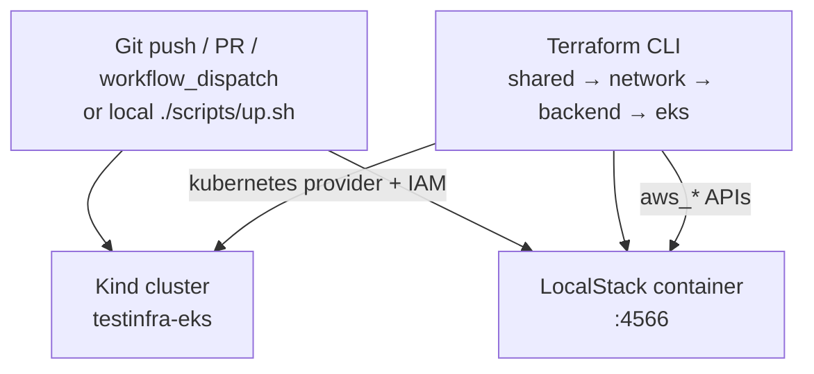
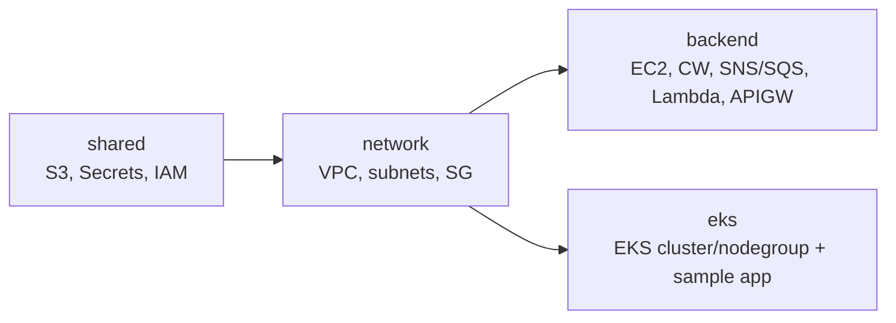
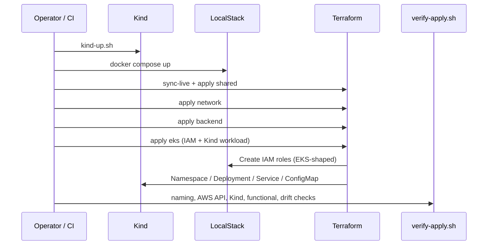

# Architecture

## Runtime flow (local / GitHub Actions)



```
                    Git Push / PR / workflow_dispatch  (or local scripts)
                                   │
                 ┌─────────────────┴─────────────────┐
                 ▼                                   ▼
        kind create cluster                 docker compose up
        (testinfra-eks)                     (LocalStack free)
                 │                                   │
                 │  .kube/kind-config                │
                 │  (host kubectl / TF k8s)          │
                 └─────────────────┬─────────────────┘
                                   ▼
                         Terraform CLI (local tfstate)
              shared → network → backend → eks
                                   │
              ┌────────────────────┼────────────────────┐
              ▼                    ▼                    ▼
        LocalStack APIs     IAM roles for EKS      kubernetes provider
        :4566               (mirror)               → Kind workloads
```

Optional: set `BACKEND=cloud` for Terraform Cloud remote state. Workspaces must use
`execution_mode=local` — TFC agents cannot reach LocalStack, Kind, or parent-dir modules.

## Kind ↔ LocalStack EKS mirror

LocalStack **community** does not implement the EKS API (Pro-only). This repo mirrors the
usual LocalStack/AWS EKS Terraform shape on **Kind** instead:

| Real AWS / LocalStack Pro EKS | This repo (free) |
|---|---|
| `aws_eks_cluster` | Logical cluster name + synthetic ARN + Kind control plane |
| `aws_eks_node_group` | Logical node group + Kind worker node(s) |
| Cluster / node IAM roles | `aws_iam_role` on LocalStack (same trust policies) |
| Workloads | Terraform **kubernetes** provider → Kind |
| Sample exposure | NodePort `30080` (Kind `extraPortMappings`) |
| Cluster record | ConfigMap `eks-mirror-<name>` in Kind `default` ns |

## Responsibilities

| Component | Role |
|---|---|
| **GitHub Actions / scripts** | Orchestrates Kind + LocalStack + Terraform CLI |
| **Kind** | Real local Kubernetes (EKS stand-in) |
| **LocalStack** | Emulates AWS APIs (S3, IAM, EC2, Lambda, API GW, SNS/SQS, **EKS**, …) |
| **Terraform CLI** | Plans/applies against LocalStack + Kind |
| **Terraform Cloud** | Optional remote state only (`BACKEND=cloud`, `execution_mode=local`) |

## Terraform projects (per environment)



| Project | Resources |
|---|---|
| **shared** | S3 buckets (+ public access block), Secrets Manager, IAM role/instance profile |
| **network** | VPC (DNS on), 3 public + 3 private subnets, IGW, public/private RTs, SG (443 + 3000) |
| **backend** | EC2 in private subnet, CloudWatch log group, SNS→SQS, Lambda, API Gateway |
| **eks** | EKS-shaped IAM + Kind mirror record + sample nginx (LocalStack free: no `aws_eks_*`) |

Cross-stack reads (backend/eks → network/shared):

- **TFC mode** (`tfc_organization = "ExperimentTerraform"`): `tfe_outputs`
- **Local mode** (`tfc_organization = ""`): `terraform_remote_state` on sibling `terraform.tfstate` files

## Environments

| Env | VPC CIDR | Resource prefix | EKS cluster name |
|---|---|---|---|
| `dev` | `10.3.0.0/16` | `testinfra-dev` | `testinfra-eks-dev` |
| `staging` | `10.1.0.0/16` | `testinfra-stg` | `testinfra-eks-staging` |

## Apply / verify sequence



## Security notes for CI

- LocalStack binds to the Actions job network (`localhost:4566`). It is **not** published to the public internet.
- Dummy AWS keys (`test`/`test`) are only valid inside LocalStack.
- Kind kubeconfig lives at `.kube/kind-config` (used by Terraform kubernetes provider + verify).
- The only secret required for optional TFC is `TF_TOKEN_app_terraform_io`.
