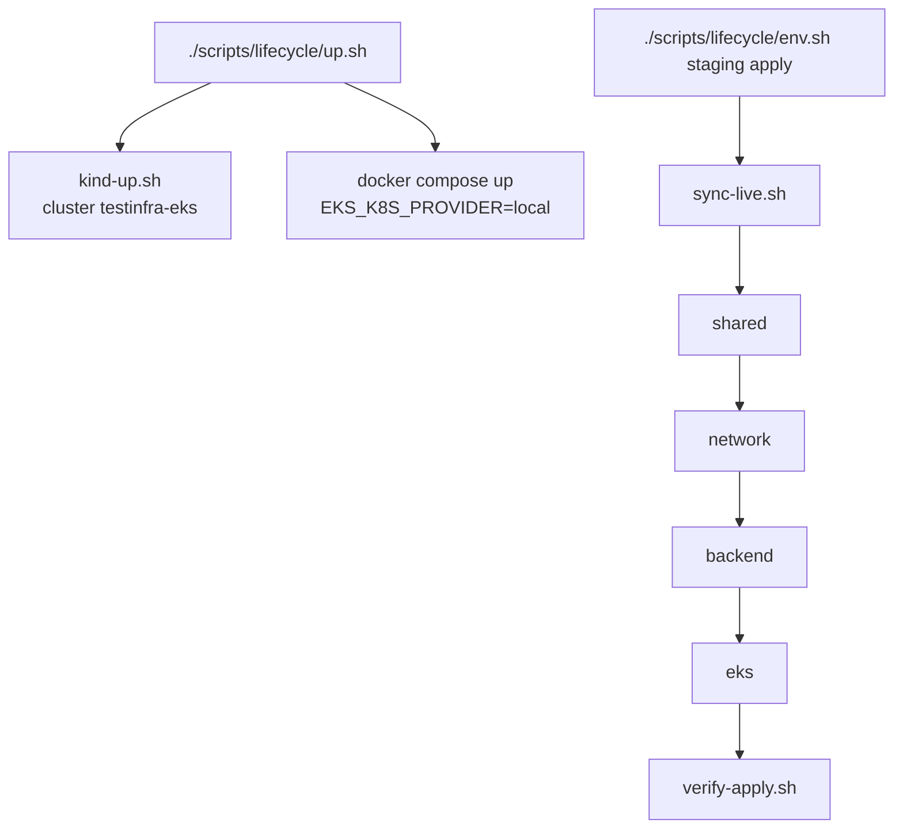

# Step-by-step guide

How to apply / destroy with **LocalStack + Kind (EKS mirror)**, optionally use **Terraform Cloud**, and run **GitHub Actions**.

## Prerequisites

- Docker Desktop (or Docker Engine)
- Terraform >= 1.5
- AWS CLI v2 (`aws`) — used by `scripts/checks/verify-apply.sh`
- `kubectl`
- `curl`, `zip`, `python3`
- `kind` (auto-downloaded to `./bin/kind` by `scripts/kind/kind-up.sh` if missing)
- Optional: Terraform Cloud org + API token (only if `BACKEND=cloud`)

---

## Recommended: Kind + LocalStack + local state

```bash
chmod +x scripts/*/*.sh
./scripts/lifecycle/up.sh                    # Kind first, then LocalStack
./scripts/backend/use-local-backend.sh
./scripts/lifecycle/env.sh staging apply     # shared → network → backend → eks + verify
```

Flow:



If LocalStack is wedged (SNS/SQS hangs), reset it (Kind can stay up):

```bash
docker compose down -v && ./scripts/lifecycle/up.sh
./scripts/lifecycle/env.sh staging apply
```

Full teardown:

```bash
./scripts/lifecycle/env.sh staging destroy
docker compose down -v
./scripts/kind/kind-down.sh
```

---

## Optional: Terraform Cloud remote state

Workspaces must use **execution_mode=local** (LocalStack/Kind are not reachable from TFC agents).

```bash
cd terraform/tfc-bootstrap && terraform init && terraform apply
export TF_TOKEN_app_terraform_io="..."
./scripts/backend/use-tfc-backend.sh
./scripts/lifecycle/env.sh staging apply
```

If you see `Preparing the remote apply...`, run `./scripts/backend/ensure-tfc-local-execution.sh` or switch to `./scripts/backend/use-local-backend.sh`.

---

## GitHub Actions

Default `BACKEND=local`. PRs → **plan** staging (applies upstream stacks first so
`terraform_remote_state` can resolve on a fresh runner); push to main → **apply** staging.


CI starts **Kind + LocalStack** via `./scripts/lifecycle/up.sh`, then runs Terraform.

---

## What verify-apply checks

`scripts/checks/verify-apply.sh` asserts infra truths, not only “resource exists”:

| Area | Examples |
|---|---|
| Naming | bucket / role / secret / Lambda / EKS names per env |
| Network | CIDR `10.1`/`10.3`, 3+3 subnets, MapPublicIp, DNS, IGW attachment, SG 443+3000 |
| Shared | S3 public access block, secret JSON, IAM trust + profile binding |
| Backend | EC2 private subnet + SG + profile + `t3.small`, FIFO attrs, Lambda runtime/env, API stage URL |
| Messaging | SNS publish → SQS receive |
| EKS/Kind | cluster/nodegroup ACTIVE, Kind Ready, sample Deployment, NodePort smoke |
| Drift | `terraform plan -detailed-exitcode` for all four stacks |

---

## Troubleshooting

| Symptom | Fix |
|---|---|
| SNS CreateTopic 501 / "not yet implemented or pro" | Do **not** set `PROVIDER_OVERRIDE_SNS=asf` on LocalStack free. Reset: `docker compose down -v && ./scripts/lifecycle/up.sh` |
| SNS hang / SQS URL format errors | Compose uses `SQS_ENDPOINT_STRATEGY=off` (Terraform-compatible). Reset LocalStack then re-apply. |
| `Preparing the remote apply...` / missing `../../../modules` | Workspace is remote → `ensure-tfc-local-execution.sh` or local backend |
| `InvalidPermission.Duplicate` on SG rules | Re-sync + apply; SG uses inline rules with `ignore_changes` |
| `connection refused :4566` | `./scripts/lifecycle/up.sh` |
| Kind / kubeconfig errors | Re-run `./scripts/kind/kind-up.sh`, ensure `.kube/kind-config` exists |
| NodePort smoke fails on `:30080` | Ensure Kind cluster from `kind/cluster.yaml` (extraPortMappings) and sample Service uses node_port 30080 |
| TFC token errors | Export `TF_TOKEN_app_terraform_io` or use `BACKEND=local` |

---

## Scripts

| Script | Purpose |
|---|---|
| `up.sh` | Start Kind + LocalStack |
| `kind-up.sh` / `kind-down.sh` | Create / delete Kind cluster + kubeconfigs |
| `use-local-backend.sh` | Local tfstate (default) |
| `use-tfc-backend.sh` | Optional TFC cloud state |
| `ensure-tfc-local-execution.sh` | Force TFC workspaces to local execution |
| `env.sh` | plan/apply/destroy + verify |
| `verify-apply.sh` | Post-apply checks (AWS + Kind + drift) |
| `apply-all.sh` / `destroy-all.sh` | Both envs |
